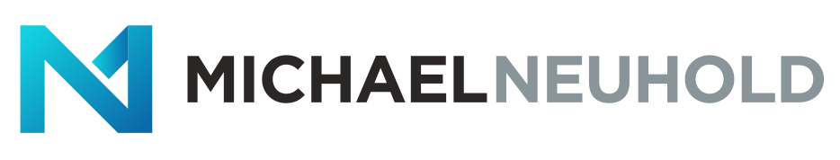

# Hi, I'm Michael 👋

I am a tech- enthusiast with a special faible for software development and software architecture. Working on projects and learning new programming languages has become one of my passions in the last 10 years 💻 🚀. 

- 🔭 Working at dynatrace
- 🌱 I’m currently working on my master thesis (decomposing monolithic architectures)
- 🎯 2023 Goal: MSc in Software Engineering
- 💬 Ask me about my coffee addiction ☕ ;)

Email:    michael@neuhold.dev  
Homepage: https://www.michael-neuhold.at  
LinkedIn: https://www.linkedin.com/in/michael-neuhold-517312157/  
Xing:     https://www.xing.com/profile/Michael_Neuhold11/cv  
Instagram:https://www.instagram.com/michi.neuhold  
Facebook: https://www.facebook.com/michael.neuhold.754
